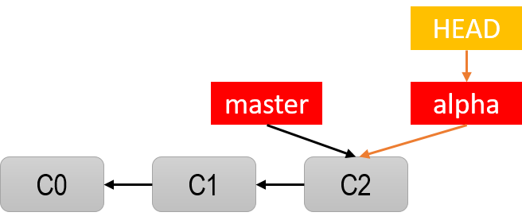
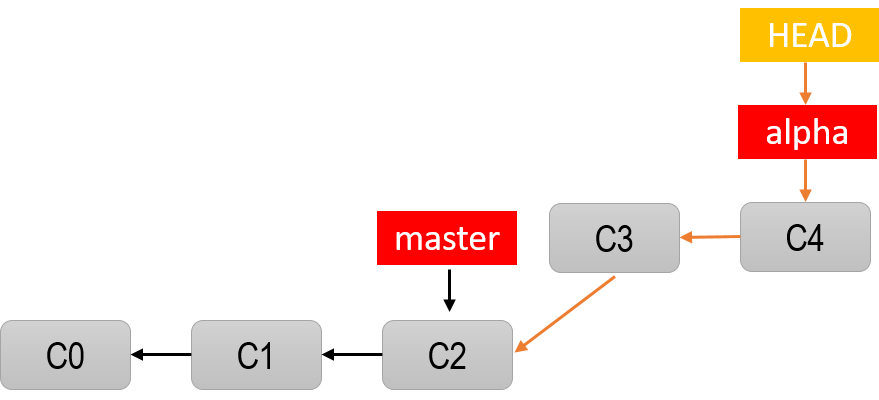

## Main branch ```Master```
### Create with 3 commit:
```
git log --oneline
d8e1fc6 (HEAD -> master) C2 - Update,Readme.md
81be31a C1 - Sua doi a.txt
126ad7f C0 - Khoi tao du an
```
### List of branches
```
git branch
* master
```
There is a branch, the symbol * indicates that (cho biết) this is the current branch.
### Create new branch
```
git branch alpha
```
Check branch:
```
git branch
  alpha
* master
```
The HEAD pointer remains on the ```master``` branch, ```alpha``` branch starts from ```C2``` commit (inheriting (kế thừa) master from C2 and earlier).


### Change working branch
```
git checkout alpha
#or
git switch alpha
```
Check branch:
```
git branch
* alpha
  master
git log --oneline
d8e1fc6 (HEAD -> alpha, master) C2 - Update,Readme.md
81be31a C1 - Sua doi a.txt
126ad7f C0 - Khoi tao du an
```
Both ```master``` and ```alpha``` are pointing to ```C2``` commit but the HEAD pointer indicates (cho biết) working on the ```alpha``` branch.


### Make a commit on ```alpha``` branch
```
git log --oneline
06e9842 (HEAD -> alpha) C3
d8e1fc6 (master) C2 - Update,Readme.md
81be31a C1 - Sua doi a.txt
126ad7f C0 - Khoi tao du an
```
```alpha``` branch has a ```C3``` commit and inherits old commits from ```master``` (C0,C1,C2) starting from ```C2``` .


Next create commit on ```alpha``` branch:
```
git log --oneline
6a48924 (HEAD -> alpha) C4
06e9842 C3
d8e1fc6 (master) C2 - Update,Readme.md
81be31a C1 - Sua doi a.txt
126ad7f C0 - Khoi tao du an
```


### Switch back to work on the ```master``` branch and create a new commit here
```
git checkout master                                                   
Switched to branch 'master'
git status                                                   
On branch master
Untracked files:
  (use "git add <file>..." to include in what will be committed)
        Branch/

nothing added to commit but untracked files present (use "git add" to track)

git add .     

git commit -m"C5"                                                   
[master 67e4edf] C5
 1 file changed, 0 insertions(+), 0 deletions(-)
 create mode 100644 Branch/gitbranch-4310.png

 git log --oneline
 67e4edf (HEAD -> master) C5
d8e1fc6 C2 - Update,Readme.md
81be31a C1 - Sua doi a.txt
126ad7f C0 - Khoi tao du an
```


### Create new branch from master
The code in the ```master``` needs to be edited and tested immediately, with the hope that during the process of modifying the code and checking errors, it will not mess up the lines of code being worked on with the ```master```, so a new branch can be immediately created:
```
git branch sualoigap        #create new branch
git checkout sualoinhanh    #switch branch
```
Check branch:
```
git log --oneline
67e4edf (HEAD -> sualoigap, master) C5
d8e1fc6 C2 - Update,Readme.md
81be31a C1 - Sua doi a.txt
126ad7f C0 - Khoi tao du an
```


HEAD pointer indicates working on the ```sualoigap``` branch.

Next create a commit on ```sualoigap``` branch:
```
git log --oneline
f1ee977 (HEAD -> sualoigap) C7
2815cd4 C6
67e4edf (master) C5
d8e1fc6 C2 - Update,Readme.md
81be31a C1 - Sua doi a.txt
126ad7f C0 - Khoi tao du an
```


## Branch Merge
Merge the ```sualoigap``` branch into the ```master``` branch:
```
git checkout master                                                   
Switched to branch 'master'
git merge sualoigap                                                
Updating 67e4edf..5b0d8cc
Fast-forward
 Branch/1.txt              |   2 ++
 Branch/gitbranch-43.png   | Bin 0 -> 27542 bytes
 Branch/gitbranch-4320.png | Bin 0 -> 31197 bytes
 Branch/gitbranch-4322.png | Bin 0 -> 37280 bytes
 4 files changed, 2 insertions(+)
 create mode 100644 Branch/1.txt
 create mode 100644 Branch/gitbranch-43.png
 create mode 100644 Branch/gitbranch-4320.png
 create mode 100644 Branch/gitbranch-4322.png

git log --oneline
5b0d8cc (HEAD -> master, sualoigap) C7
2815cd4 C6
67e4edf C5
d8e1fc6 C2 - Update,Readme.md
81be31a C1 - Sua doi a.txt
126ad7f C0 - Khoi tao du an
```


## Delete branch
Delete ```sualoigap``` branch:
```
git branch
  alpha
* master
  sualoigap

git branch -d sualoigap                                                
Deleted branch sualoigap (was 5b0d8cc).

git branch
  alpha
* master
```


## Handle conflicts when merging branches
Now we merge the ```alpha``` branch into the ```master``` branch because both branches have many commit since the branch time (thời điểm rẽ nhánh), so when merging, git does not automatically create new commit and it pauses so we can processes each (từng) conflicting file and create issue a commit after resolvign all conflicts (xung đột).
