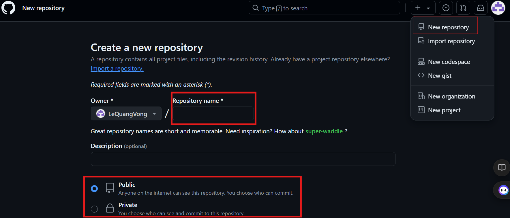

## Create GitHub and work through git command
### Create Repo on GitHub


- Select ```New Repository```
- Enter ```Repository name```
- Select ```Public``` or ```Private```
- Finally select ```Create repository```

```Repo``` on GitHub has been created, indicating the address of this ```Repo```
Ex: Address HTTPS of Repo: ``` https://github.com/LeQuangVong/learnGitHub.git```
### Estabilish (thiết lập kết nối) Local Repo connection with GitHub Repo
- If there is already a local Repo available use command:
```
git remote add origin https://github.com/LeQuangVong/learnGitHub.git
# origin: remote Repo name
# https://github.com/LeQuangVong/learnGitHub.git: address HTTPS of Repo
```
- Set up a new local Repo, use command:
```
git clone https://github.com/LeQuangVong/learnGitHub.git \<address>
#address: The localtion where you want to save the local Repo
```
### Push all ```local``` to ```GitHub```
```
git push origin --all    #push all
git push origin master   #push master branch
```
### Edit files on GitHub and update information from GitHub
- Update information from GitHub:
```
git fetch origin
```
- Update local change information:
```
git pull origin master
#master: because of information changes on the master branch
```
